# Graphwar 项目最终验收报告

> **项目名称**：Graphwar — 基于数学函数图像的双人对战游戏  
> **项目版本**：v1.0 正式版  
> **提交日期**：2026年7月17日

#### 小组成员：杨瑞潼、李之彦
---

## 一、成果展示

**项目功能清单**：

| 模块 | 状态 | 说明 |
|------|------|------|
| **启动页** | ✅ | 标题、副标题、NEW GAME / LOAD GAME / HOW TO PLAY 按钮 |
| **配置页** | ✅ | 方格数、障碍物数/大小、玩家颜色、坐标标签/网格线开关 |
| **游戏画布** | ✅ | 坐标系、双方方块、障碍物、弹道轨迹（带发光效果）、网格线、坐标标签 |
| **函数输入面板** | ✅ | 输入框、回车发射、点数预览、消息提示、FIRE 按钮、PAUSE 按钮 |
| **表达式解析器** | ✅ | Tokenizer + ShuntingYard + Token 流求值/计费 |
| **发射与动画** | ✅ | 沿曲线逐帧推进；碰障碍物/出界两种终止条件 |
| **点数系统** | ✅ | 表达式总点数设有上限，点数上限随回合递增 |
| **暂停系统** | ✅ | PAUSE 按钮/ESC 触发；暂停菜单含继续/存档/返回标题 |
| **存档系统** | ✅ | JSON 存档；Load/Delete；读档恢复配置 |
| **障碍物系统** | ✅ | 随机生成、最小间距、被破坏变为虚线轮廓 |
| **胜负判定** | ✅ | 弹出对话框，显示统计数据 |
| **坐标标签** | ✅ | 顶栏左右两侧显示，带黑色描边 |
| **粒子特效** | ✅ | 命中时产生粒子爆炸效果 |
| **音频系统** | ✅ | BGM 和音效播放，支持音量调节和静音 |
| **游戏统计** | ✅ | 每局统计发射次数、命中次数、命中率等数据 |
| **回合过渡动画** | ✅ | 进度条 + 文字渐入效果 |
| **游戏引导页** | ✅ | 完整的游戏规则说明 |
| **跨平台打包** | ✅ | Windows/Linux 打包支持 |
### 1.1 项目运行效果截图

#### ① 开始页（含 HOW TO PLAY 引导按钮）

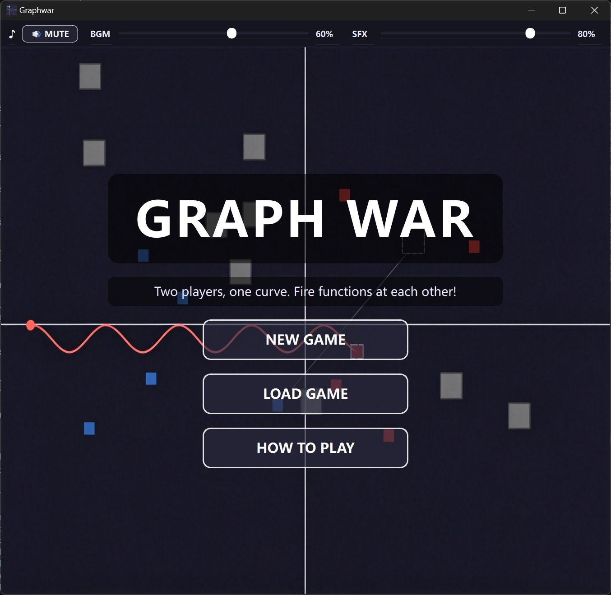

**说明**：深色背景 `#0f0f1a`，标题"GRAPH WAR"采用大字体发光效果，副标题"Two players, one curve. Fire functions at each other! "，三个按钮呈垂直排列：NEW GAME（进入配置页）、LOAD GAME（进入存档管理页）、HOW TO PLAY（进入游戏引导页）。

#### ② 游戏进行中（函数轨迹发光效果）

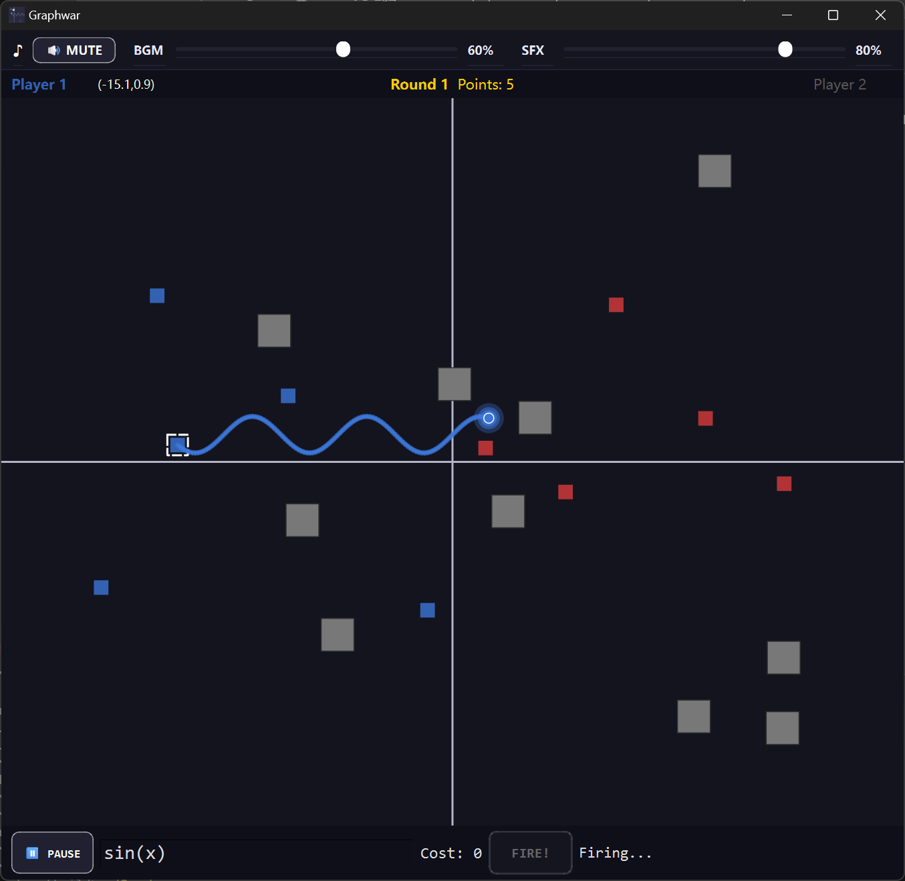

**说明**：游戏画布展示了当前玩家（P1 红色）发射的函数轨迹，轨迹带有三层发光效果（外层 5px 半透明、内层 3px 半透明、核心 1px 实线），弹头带有光晕效果。画面中可见双方方块、障碍物、坐标轴，以及由玩家设置选择是否显示的网格线。回合过渡时底部会有进度条。

#### ③ 游戏结束弹窗（含统计数据）

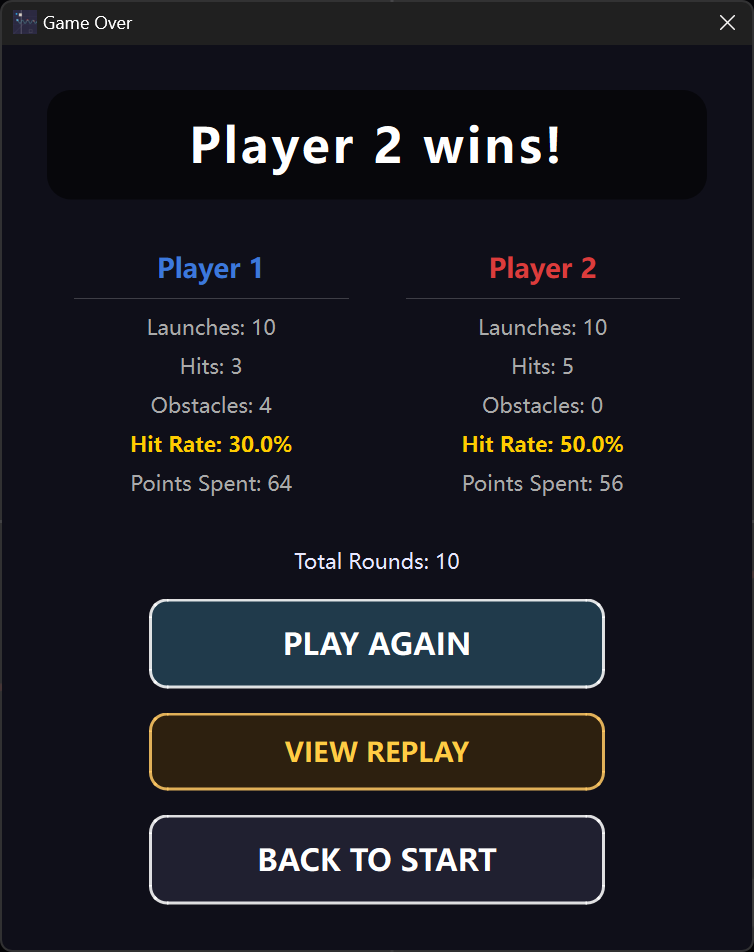

**说明**：游戏结束时弹出半透明遮罩对话框，显示获胜玩家信息、双方存活方块数、当前回合数，以及双方的详细统计数据（发射次数、命中次数、障碍物破坏次数、命中率、消耗点数）。玩家名称使用各自配置的颜色显示。

#### ④ 游戏引导页

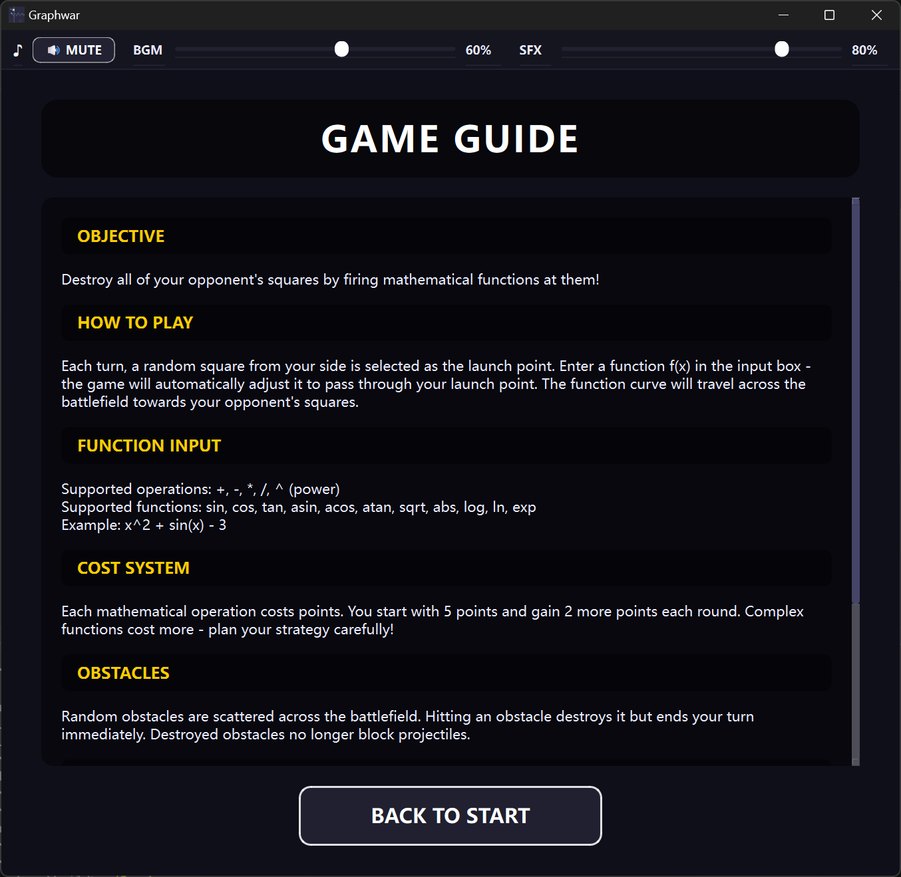

**说明**：引导页采用滚动区域展示游戏规则，包含 OBJECTIVE（游戏目标）、HOW TO PLAY（玩法说明）、FUNCTION INPUT（函数输入语法）、COST SYSTEM（点数消耗系统）、OBSTACLES（障碍物说明）、WINNING（胜利条件）、TIPS（游戏技巧）等章节，底部有"BACK TO START"返回按钮。

#### ⑤ 配置页

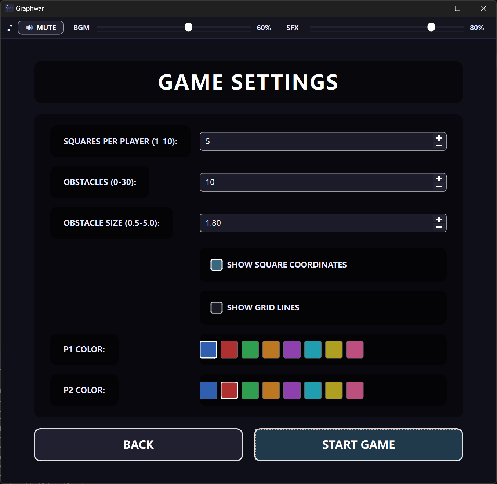

**说明**：配置页采用深色 `#141420` 背景，表单容器为圆角卡片风格。包含游戏参数设置：方格数（SpinBox）、障碍物数量/大小（SpinBox）、玩家颜色选择（8 色预设色块按钮）、坐标标签和网格线开关（CheckBox），底部有 START GAME 和 BACK 按钮。

#### ⑥ 暂停菜单页

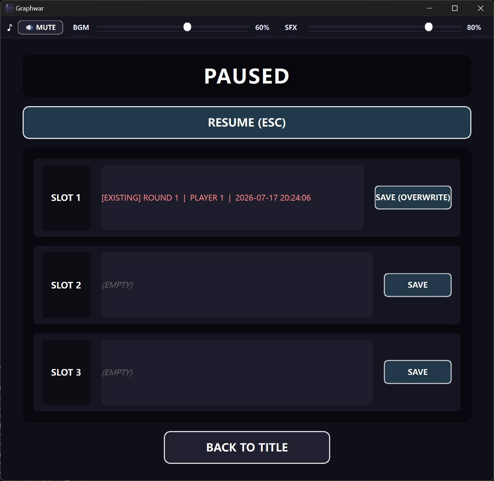

**说明**：暂停菜单页采用深色半透明背景，包含 Resume 按钮（继续游戏）、三个存档槽位（每个显示 Slot N / Round / Player / 时间戳 / Save 按钮）、BACK TO TITLE 按钮（返回标题页）。

#### ⑦ 存档管理页

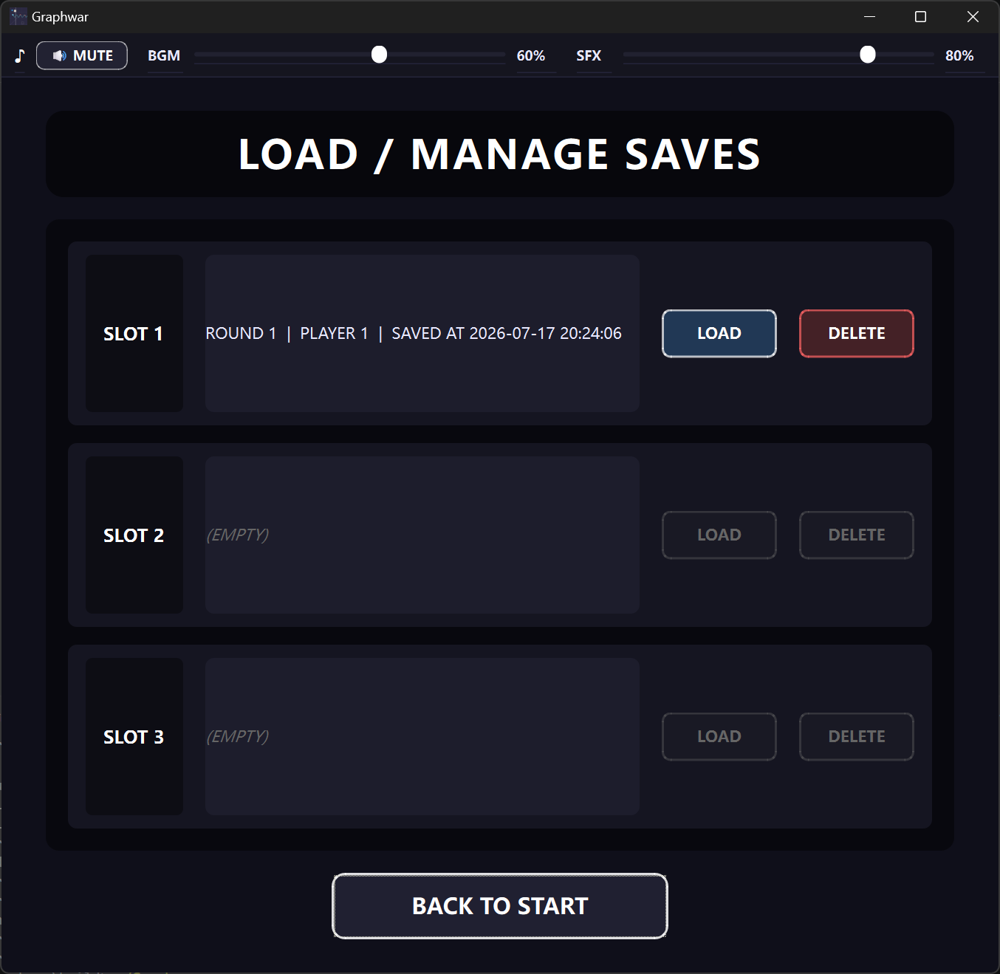

**说明**：存档管理页展示三个存档槽位，每个槽位显示 Round（回合数）、Player（当前玩家）、Saved at（保存时间），以及 LOAD（加载）和 DELETE（删除）按钮，底部有 BACK TO START 按钮返回起始页。

#### ⑧ 回放页

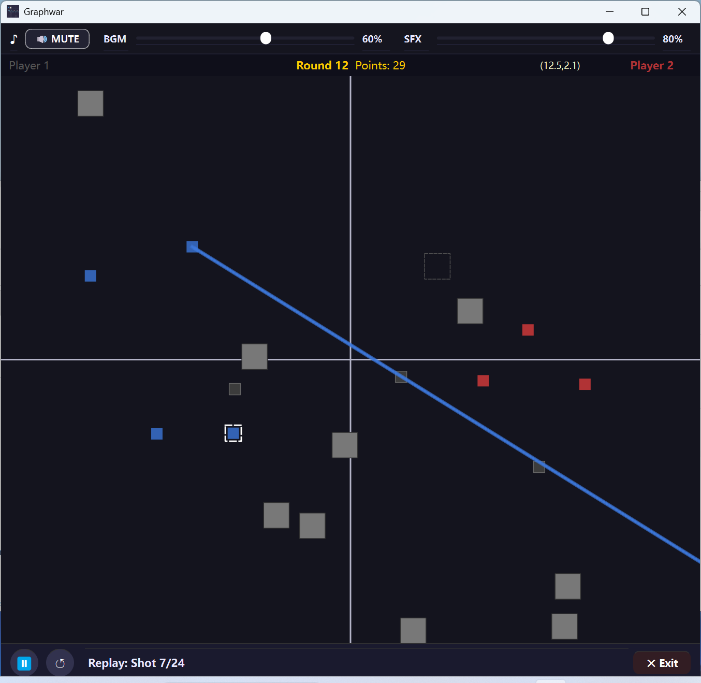

**说明**：游戏结束后可在 Game Over 弹窗点击 VIEW REPLAY 进入回放模式。画布恢复到开局初始状态，依次回放当局每一发射击的完整过程。回放期间函数输入框隐藏，底部显示回放控制栏（Play/Pause、Restart、Exit），轨迹颜色按当前发射的玩家自动切换。ESC 键退出回放，返回标题页。

### 1.2 辅助截图

#### ① 编译构建成功

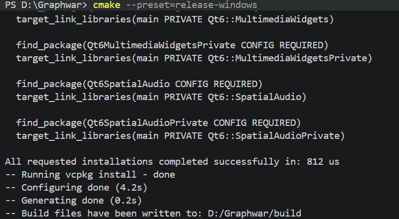
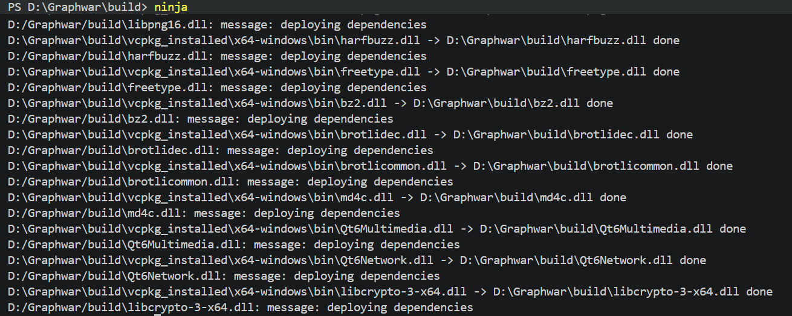

**说明**：在 Windows 环境下使用 CMake + Ninja 构建系统成功编译项目，无警告、无错误。

#### ② 跨平台打包结果

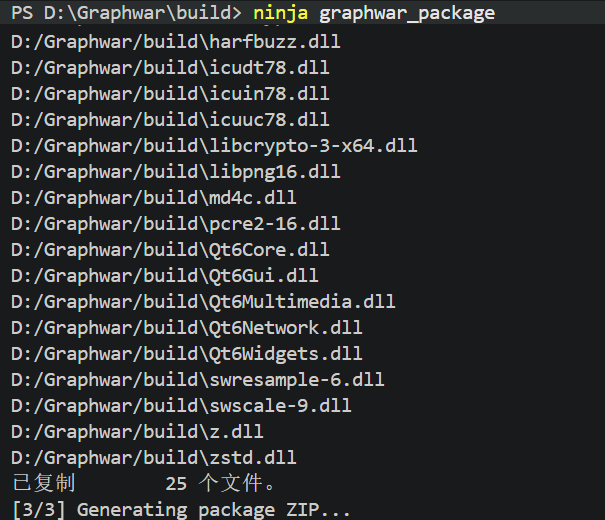
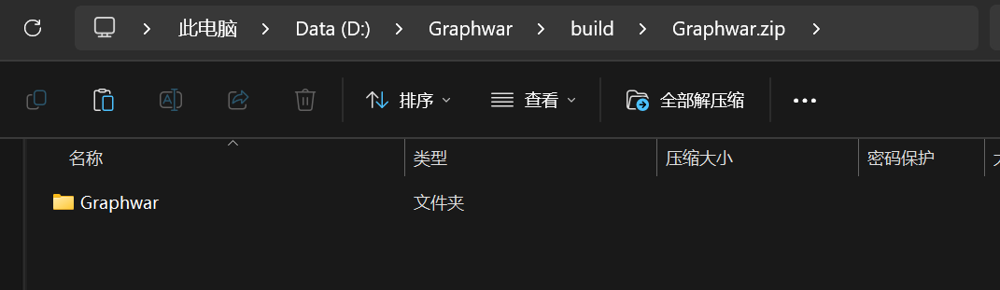
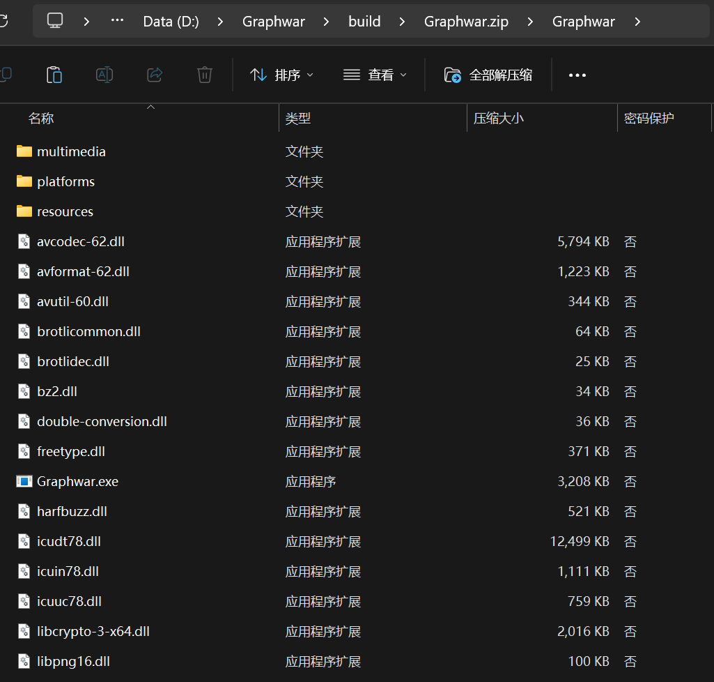

**说明**：成功生成跨平台压缩包 `Graphwar.zip`，包含可执行文件、依赖 DLL、音频资源等，压缩包及内部根文件夹名称均为 `Graphwar`。

---

## 二、智能体的使用

### 2.1 智能体配置与工具链

| 配置项 | 说明 |
|--------|------|
| **AI 助手** | OpenCode(DeepSeek) & Trae |
| **上下文管理** | 通过 `PLAN.md` 保持任务/架构的一致性 |
| **代码读写** | 支持文件级 Write（覆盖/新建）和行级 Edit（精确替换） |
| **构建能力** | 通过 Shell 工具在本地运行编译命令并收集错误日志 |
| **文件搜索** | 支持 glob 搜索、grep 内容搜索、目录浏览 |
| **任务分解** | 通过 TodoList 工具进行多步任务的规划与进度追踪 |

### 2.2 MCP Server 设置

当前项目未使用 MCP Server。

### 2.3 规则文档与技能文档的编写

`PLAN.md` 是项目的唯一规则文档，包含：

- **游戏规则**：基本概念、障碍物系统、游戏统计功能、胜负条件、开始界面、方格布局、资源点数系统、历史轨迹、粒子特效系统、音频系统、回合过渡动画、暂停系统、存档系统
- **技术栈与项目结构**：MVVM + PropertyTrigger + Command 架构模式、每层职责说明
- **核心模块详细设计**：数学表达式解析器、游戏引擎状态机、粒子系统、音频系统、画布渲染、碰撞检测、存档系统、回放系统、UI布局、应用图标
- **构建与运行**：跨平台构建说明、常见问题

**编写策略**：每次架构调整后同步更新 PLAN.md 的结构树和通信模式说明，确保文档始终反映最新代码。

### 2.4 每轮对话的记录

典型对话流：

1. **需求描述** → 用户提出具体问题或需求
2. **代码分析与修复** → AI 搜索相关代码，定位问题原因，提出修改方案
3. **实现修改** → AI 使用 Edit/Write 工具修改代码
4. **验证** → 用户本地编译测试，反馈错误日志
5. **迭代** → 根据编译错误或行为不符继续修正

关键架构决策（如 MVVM 分层、PropertyTrigger 通信模式）记录在 `PLAN.md` 中。

#### 对话记录

对话较长，选取中期验收之后的部分截图

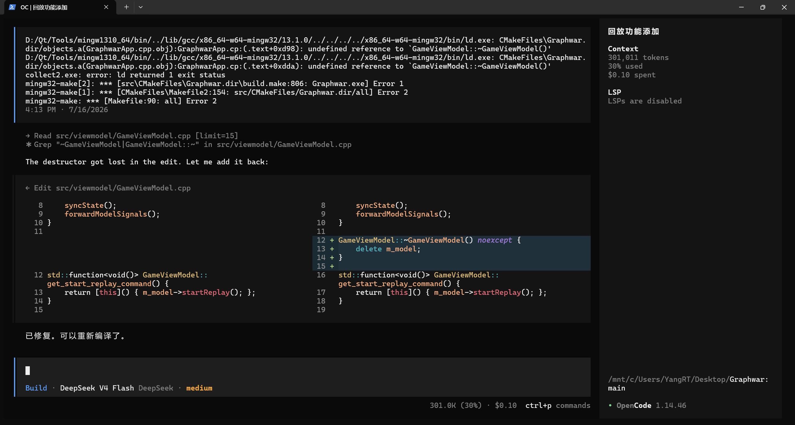

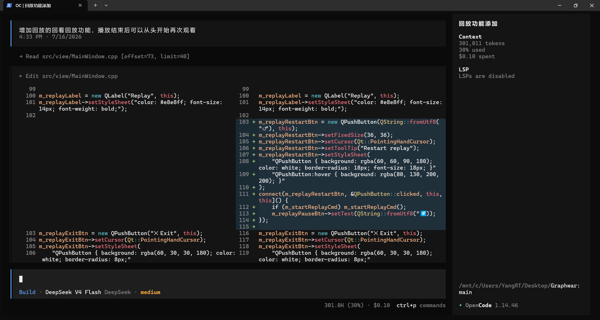

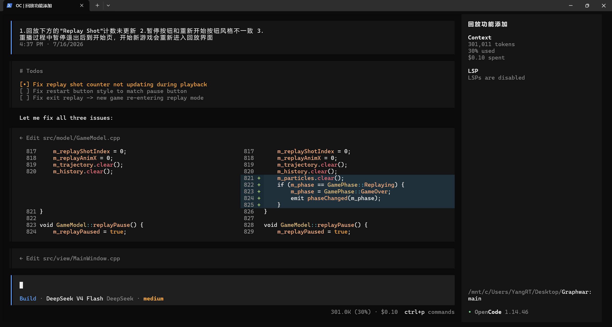

### 2.5 实际效果与现存问题

**实际效果**：

1. **代码修改精度高**：行级 Edit 工具能精确定位并替换代码片段，避免整文件重写
2. **跨文件重构能力**：将架构从 EventBus 迁移到 PropertyTrigger + Command 模式，涉及 20+ 个文件的逐文件修改，AI 能保持一致性
3. **多文件上下文理解**：AI 能同时理解 common/frame、viewmodel/commands、view/widgets 等不同层的代码，进行跨层修改
4. **视觉效果实现能力强**：AI 能够实现复杂的视觉效果，如函数轨迹发光效果、粒子爆炸特效、回合过渡动画等，通过多层绘制叠加和缓动函数实现出色的视觉体验
5. **文档同步更新**：在功能开发完成后，AI 能够自动同步更新 PLAN.md 文档，确保文档始终反映最新代码状态

**现存问题**：

1. **include 路径管理**：AI 在记住文件新位置（如从 model/ 移到 common/ 又移回 model/）方面偶尔会出现路径错误
2. **Qt 特有机制**：`QObject::connect` 在非 QObject 类中的调用需要显式加命名空间限定，AI 初期容易遗漏
3. **编译错误迭代**：AI 编写程序有小概率出现编译错误，需要人类反馈后修复
4. **UI 参数微调**：发光效果宽度、透明度、动画时长等参数需要人类多次调整才能达到满意效果，AI 缺乏直接的视觉感知能力

---

## 三、学习回顾与个人总结

### 3.1 知识掌握

#### 理论理解与概念应用

1. **MVVM 架构模式**：深入理解了 Model-View-ViewModel 的分层设计理念，实现了 View 层与 Model/ViewModel 的完全解耦
2. **状态管理**：通过 PropertyTrigger 实现了响应式状态更新，理解了单向数据流的设计思想
3. **命令模式**：使用 Command 模式封装用户操作，实现了操作的可撤销和可记录
4. **状态机设计**：游戏引擎采用状态机模式管理游戏阶段（WaitingInput → Animating → RoundEnd → Transition → GameOver）
5. **数学表达式解析**：实现了完整的表达式解析器（Tokenizer → ShuntingYard → Evaluator），理解了编译原理的基本概念

### 3.2 技能提升

#### 技术能力与实践水平的进步

1. **C++ 编程能力**：掌握了现代 C++ 特性（智能指针、Lambda 表达式、STL 容器），理解了内存管理和资源生命周期
2. **Qt 框架应用**：熟练使用 Qt6 的 Widgets、Multimedia、Network 模块，掌握了信号槽机制、自定义控件开发
3. **CMake 构建系统**：掌握了 CMake 的高级用法（条件编译、自定义目标、跨平台配置），实现了跨平台打包
4. **图形渲染**：掌握了 QPainter 的使用，实现了复杂的图形绘制（网格线、函数轨迹、发光效果、粒子系统）
5. **音频处理**：使用 Qt Multimedia 实现了 BGM 和音效播放，支持音量调节和静音
6. **序列化**：使用 JSON 实现了游戏存档系统，支持存档的保存、加载和删除

### 3.3 团队协作

#### 沟通、协调与合作经验

1. **需求拆解**：学会了将复杂需求拆解为可执行的小步骤，通过 TodoList 工具跟踪进度
2. **渐进式需求**：人类不需要一开始就提出完美需求，可以在迭代过程中逐步完善
3. **快速验证**：每次修改后及时编译验证，减少返工
4. **文档驱动**：维护一份与代码同步的规则文档，作为团队协作的基石
5. **反馈闭环**：建立了"需求 → 实现 → 验证 → 反馈 → 修复"的闭环流程

### 3.4 个人总结

#### 杨瑞潼

> 在本次项目中，我主要承担架构设计和技术选型的角色，从项目初期的 EventBus 模式到后来的 PropertyTrigger + Command 模式。项目后期，我负责了音频系统修复和回放系统架构设计，确保 BGM 和音效能够正确播放，支持音量调节和静音功能。最大的挑战是如何在跨平台环境下保证音频的稳定播放，解决 Qt Multimedia 在不同平台上的兼容性问题，同时还要确保音频系统与游戏逻辑的正确集成。通过引入 AudioManager 单例管理音频资源，并使用 QAudioSink 控制音频输出，我们成功实现了这一目标。
>
> 在与 AI 协作的过程中，我学会了如何将复杂的架构调整需求转化为 AI 能够理解和执行的具体任务。通过 TodoList 工具，我们将大规模重构拆解为多个小步骤，每完成一个步骤就编译验证，确保了重构过程的稳定性。每次添加新功能前，先更新 PLAN.md 的设计文档，让 AI 能够更好地理解需求并生成高质量的代码。
>
> 最终获得的成长是对"架构"在实际工程中意义的深刻理解。一个好的架构不仅是代码的组织方式，更是团队协作的基础。通过维护清晰的规则文档和分层结构，我们能够高效地与 AI 协作，在有限时间内完成了丰富的功能实现。同时，我也学会了如何在项目迭代过程中保持架构的一致性和可扩展性，这对我今后的软件开发工作将产生深远影响。

#### 李之彦

> 在本次项目中，我主要负责功能实现和效果调试。从核心游戏逻辑到各种 UI 效果（粒子特效、发光效果、过渡动画），我与 AI 紧密配合完成了所有功能的实现和优化。项目后期，我专注于视觉效果的提升，包括函数轨迹的发光效果、弹头的光晕效果、粒子爆炸特效以及回合过渡动画。最大的挑战是视觉效果的调试——发光效果的宽度、透明度，动画的时长、缓动函数等都需要多次调整才能达到满意的效果，而 AI 缺乏直接的视觉感知能力，这就需要人类的审美判断来指导优化方向。
>
> 在与 AI 协作的过程中，我发现"渐进式需求"是最有效的协作方式。不需要一开始就提出完美需求，可以先提出一个大致方向，然后根据实际效果逐步调整。例如，添加发光效果时，我先要求"添加函数轨迹绘制时的发光效果"，然后根据效果反馈"发光的效果再明显一点"、"当前轨迹改窄一点"，最终达到了满意的效果。这种交互式的协作方式让我能够充分发挥人类的审美优势，同时利用 AI 的代码实现能力。
>
> 最终获得的成长是对 C++ 和 Qt 框架的深入理解。通过阅读和修改大量代码，我对内存管理、信号槽机制、图形渲染等技术有了更深刻的认识。特别是在实现发光效果和粒子系统时，我学会了如何通过多层绘制叠加和透明度控制来创造出色的视觉效果。同时，我也学会了如何与 AI 高效协作，将 AI 的代码生成能力与人类的审美判断和架构思考相结合，实现了 1+1>2 的效果。这种人机协作模式让我对未来的软件开发方式有了新的思考。

---

## 四、课程改进建议

1. **强化跨平台开发教学**：增加 Linux 下的开发和调试教学，帮助学生掌握真正的跨平台开发技能
2. **分组协作模式优化**：可以尝试更大规模的团队协作（4-5 人），让学生体验更真实的软件开发流程
3. **代码库管理教学**：增加 Git 协作、代码审查、版本控制等方面的教学内容
4. **反馈机制优化**：建立更及时、更具体的反馈机制，帮助学生快速发现和解决问题

---

## 结语

Graphwar 项目已完成全部功能开发，包括核心玩法、视觉效果、音频系统、存档系统、统计功能等。项目采用 MVVM + PropertyTrigger + Command 架构模式，实现了 View 层与业务逻辑的完全解耦，代码结构清晰，可维护性强。

在 AI 辅助下，我们高效地完成了功能开发和架构优化。AI 的代码生成能力大大提高了开发效率，而人类的架构思考和审美判断则确保了代码质量和用户体验。这种人机协作模式为软件开发带来了新的可能性，也让我们在学习过程中获得了独特的体验和成长。
