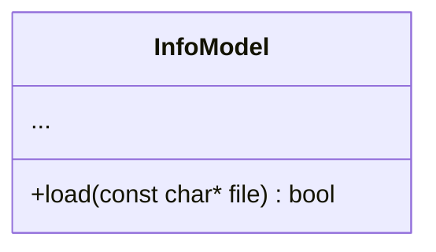
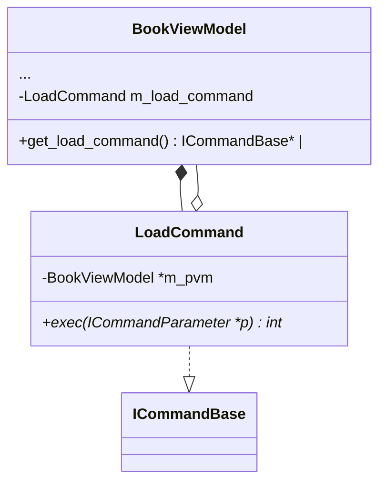
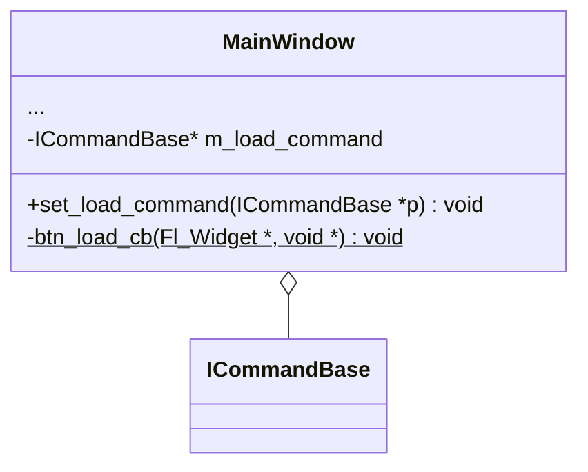


# 设计文档

## 第二轮迭代

从文件加载书的数据。

### 命令

| 名字         | 参数          | 返回值   |
|:-------------|:-------------|:---------|
| Load         | const char*  | int      |

### common层

命令参数类 LoadParameter 即 `TypeParameter<const char*>`。

### Model层

InfoModel类增加加载文件的方法，并触发通知。



### ViewModel层

BookViewModel类增加加载命令的成员对象，及获取该对象接口的方法。



### View层

MainWindow类增加加载命令的成员变量和设置方法。
增加加载按钮和回调事件。



### app层

增加加载命令的组装。

```

m_main_wnd <-- m_sp_book_viewmodel.get_load_command

```
