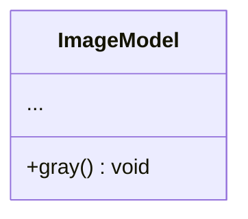
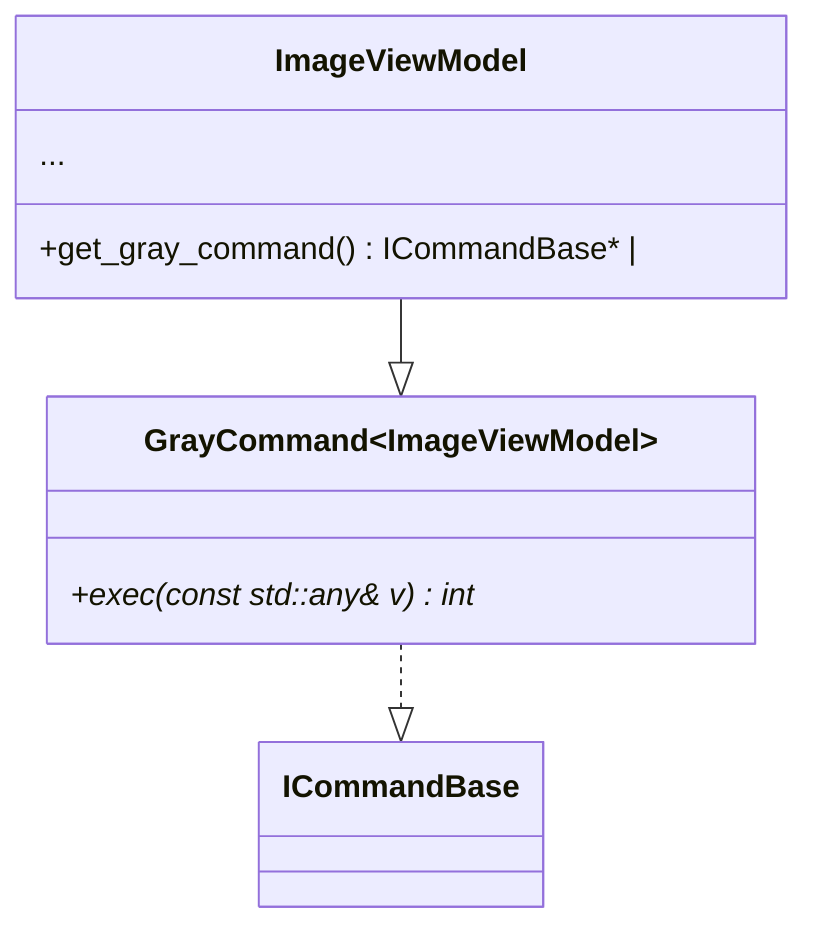
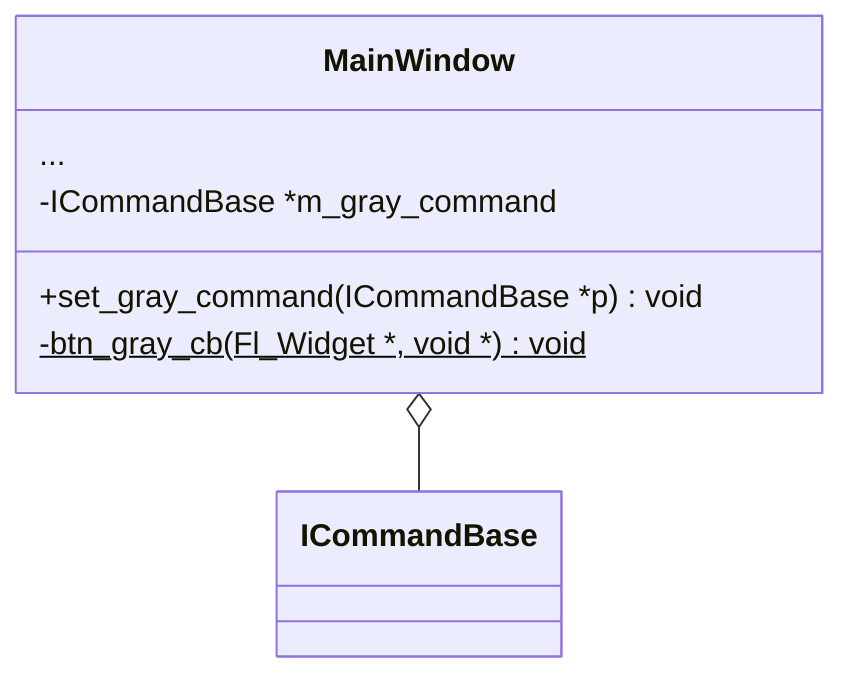


# 设计文档

## 第二轮迭代

灰度化图片。

### 命令

| 名字         | 参数          | 返回值   |
|:-------------|:-------------|:---------|
| gray         |              | int      |

### Model层

ImageModel类增加灰度化方法，触发通知。



### ViewModel层

ImageViewModel类增加灰度化命令，提供获取该命令对象接口的方法。



### View层

MainWindow类增加灰度化命令的成员变量和设置方法。
增加灰度化按钮和回调事件。



### app层

增加灰度化命令的组装。

```

m_main_wnd <-- m_image_viewmodel.get_gray_command

```
