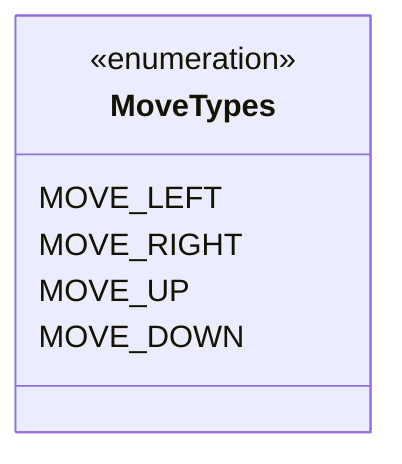
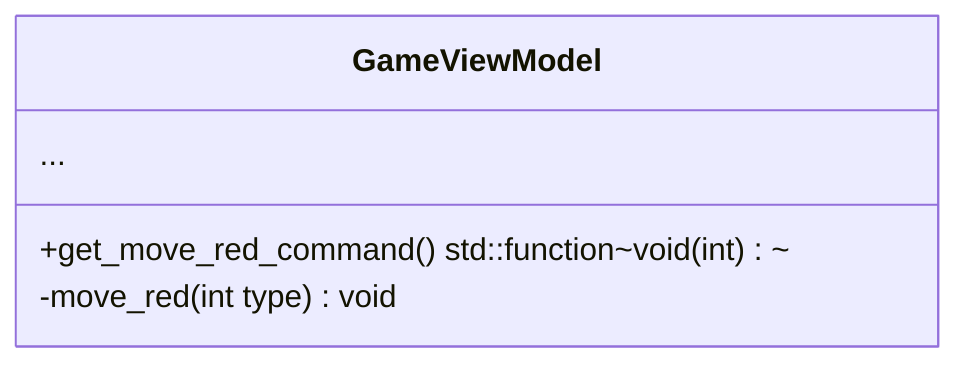
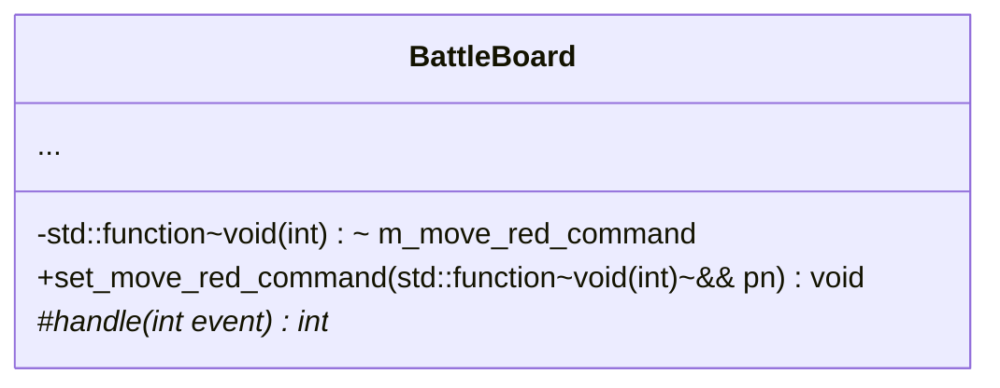


# 设计文档

## 第二轮迭代

使用键盘移动红方飞机。

### 命令

| 名字         | 参数         | 返回值   |
|:-------------|:------------|:---------|
| move_red     | int         | void     |

### common层

实现移动的类型。



### ViewModel层

GameViewModel类增加移动命令，提供获取该命令对象的方法。
增加移动红方飞机的方法。



### View层

BattleBoard类增加移动命令的成员变量和设置方法。
增加事件处理器，处理键盘消息。



### app层

增加移动命令的组装。

```

m_main_wnd.get_board <-- m_game_viewmodel.get_move_red_command

```
